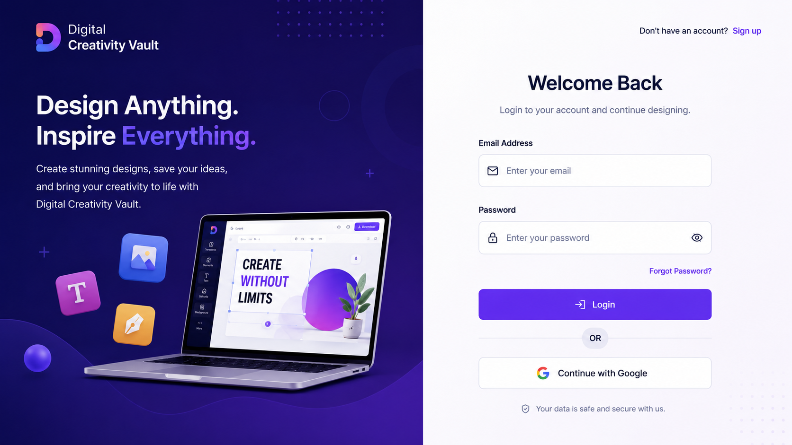
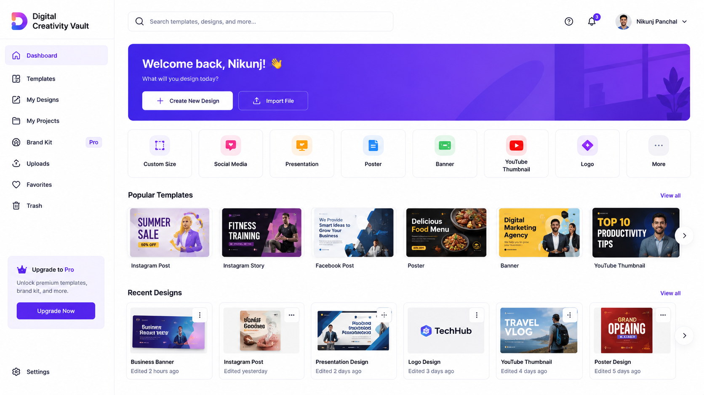
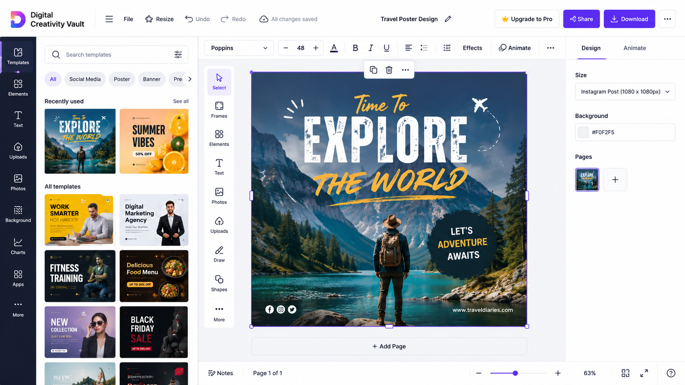
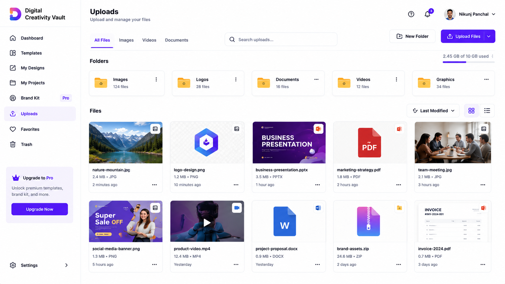
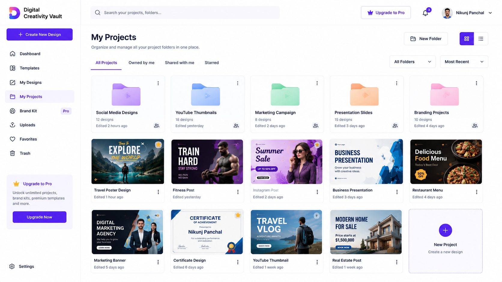

<div align="center">

# 🎨 Digital Creativity Vault

### AI-Powered Graphic Design Platform Inspired by Canva

Create stunning graphics with an advanced drag-and-drop editor, AI-assisted design tools, cloud storage, and professional templates.

<p align="center">


</p>

A modern **Canva-inspired** design platform built with **Next.js**, **Fabric.js**, **TypeScript**, **Node.js**, **Express.js**, and **MongoDB**, featuring AI-powered design tools, cloud storage, templates, and a professional drag-and-drop editor.

</div>

---

# 🚀 Features

## 🔐 Authentication

- User Registration
- User Login
- Google Authentication
- JWT Authentication
- Forgot Password
- User Profile
- Secure Sessions

---

## 🏠 Dashboard

- Modern Responsive UI
- Create New Design
- Recent Designs
- Popular Templates
- Search
- Notifications
- Favorites
- Quick Categories

---

## 🎨 Design Editor

- Fabric.js Canvas
- Infinite Workspace
- Zoom In / Out
- Fit Screen
- Layers Panel
- Properties Panel
- Drag & Drop
- Undo / Redo
- Snap to Grid
- Smart Guidelines
- Keyboard Shortcuts
- Auto Save

---

## 🖌 Design Tools

- Text
- Images
- Icons
- Shapes
- Stickers
- Backgrounds
- Frames
- Gradients
- QR Generator

---

## 🤖 AI Features

- AI Image Search
- AI Design Suggestions
- AI Layout Suggestions
- AI Color Palette
- AI Font Recommendations
- AI Background Removal

---

## 📂 Uploads

- Upload Images
- Upload Videos
- Upload Documents
- Folder Management
- Cloud Storage
- Drag & Drop Upload

---

## 📑 Templates

- Instagram Post
- Instagram Story
- Facebook Post
- YouTube Thumbnail
- Presentation
- Resume
- Poster
- Flyer
- Banner
- Logo
- Business Card

---

## 📤 Export

- PNG
- JPG
- PDF
- SVG
- High Quality Export

---

# 🎥 Demo

> Add your demo video here after uploading.

https://github.com/user-attachments/assets/8bc33815-dff4-4ce5-80b1-f9af2747e744

---


# 📸 Screenshots

## Login



---

## Sign Up


---

## Dashboard



---

## Create Design



---

## Canvas Editor


---

## Templates


---

## My Designs


---

## Uploads



---

## My Projects



---


# 🛠 Tech Stack

### Frontend

- Next.js 15
- React 19
- TypeScript
- Tailwind CSS
- Shadcn UI
- Framer Motion
- Fabric.js
- Zustand

### Backend

- Node.js
- Express.js
- JWT
- Multer
- Cloudinary

### Database

- MongoDB
- Mongoose

### APIs

- Google Gemini AI
- Unsplash API
- Pexels API
- Cloudinary API

---


# ⚙ Installation

Clone the repository:

```bash
git clone https://github.com/Nikunj-Panchal-27/digital-creativity-vault.git
```

Go to the project directory:

```bash
cd digital-creativity-vault
```

Install dependencies:

```bash
npm install
```

Run the development server:

```bash
npm run dev
```

Open your browser:

```
http://localhost:3000
```

---

# 🌟 Future Enhancements

- AI Logo Generator
- AI Resume Builder
- AI Presentation Generator
- Real-time Collaboration
- Team Workspace
- Version History
- Brand Kit
- Comments
- Plugin Marketplace
- AI Image Generator

---

# 🤝 Contributing

Contributions are welcome!

1. Fork this repository.
2. Create your feature branch.

```bash
git checkout -b feature/NewFeature
```

3. Commit your changes.

```bash
git commit -m "Added New Feature"
```

4. Push to GitHub.

```bash
git push origin feature/NewFeature
```

5. Open a Pull Request.

---

# 📄 License

This project is licensed under the **MIT License**.

---

# 👨‍💻 Author

## Nikunj Panchal

Full Stack Developer

### Connect with me

- GitHub: https://github.com/Nikunj-Panchal-27
- LinkedIn: https://www.linkedin.com/in/nikunj-panchal-16b85a2b6/
- Portfolio: https://nikunj-resume-portfolio.great-site.net/

---

<div align="center">

## ⭐ If you like this project, don't forget to Star this Repository ⭐

Made with ❤️ by **Nikunj Panchal**

</div>